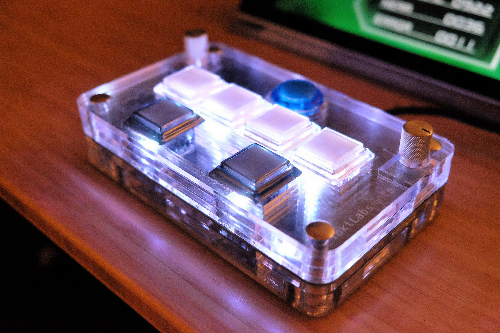
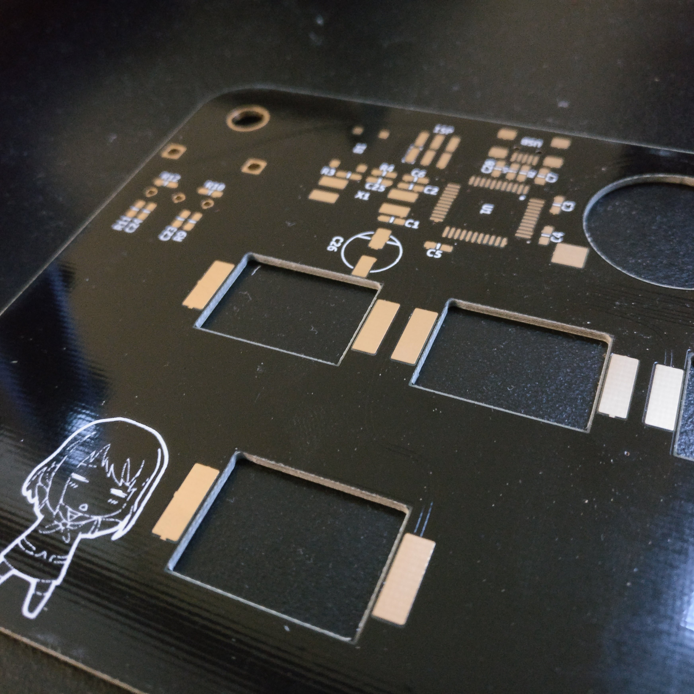
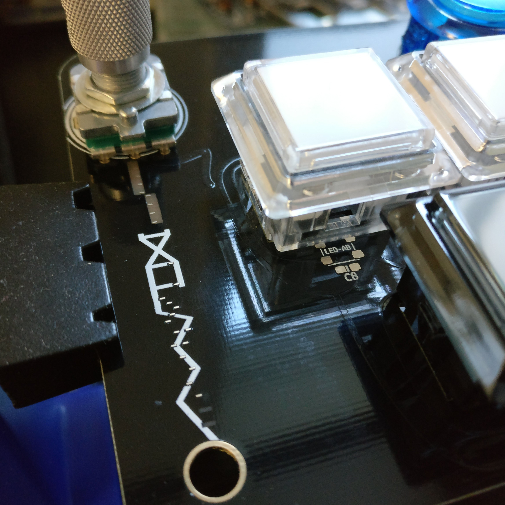
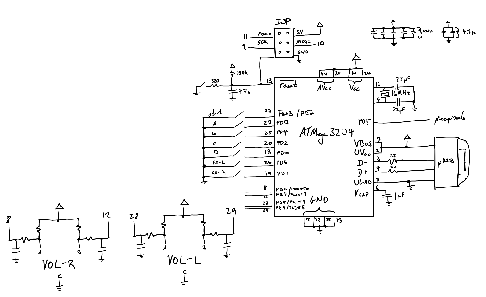

# TokiLabs Note

A small(er) size USB controller for the rhythm game kShootmania created with PCBmodE.

built using:

* Atmel ATmega32U4 
* Adafruit Neopixel RGB LED
* Sanwa OBSC-24KK Arcade Button
* Bourns PEC16-4020F Rotary Encoder

